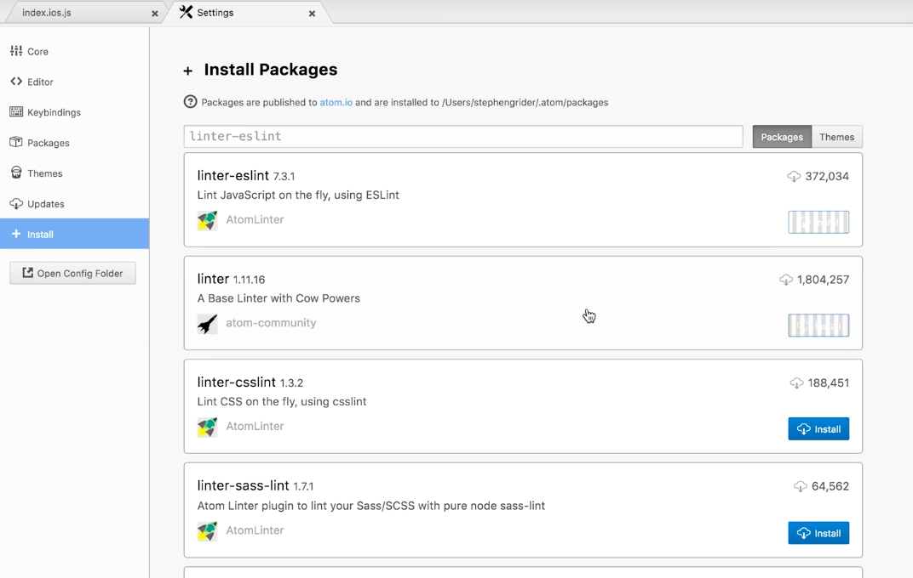

**CLONE THIS PROJECT FROM REPOSITORY**

>Version :
* [react : 16.2.0 ](https://reactjs.org/)
* [react-native : 0.53.0](https://facebook.github.io/react-native/)

```
$ git clone https://YOUR_USERNAME@bitbucket.org/techgs/temandiabetes-mobile.git && temandiabetes-mobile
$ npm install
```
---

## ESLint Setup

1. EsLint setup with **VSCode**.
    ```
    $ npm install -g eslint
    $ npm install --save-dev eslint-config-rallycoding
    ```

    create new file .eslintrc in your project

    ```javascript
    {
        "extends": "rallycoding"
    }
    ```

    Install eslint extension from editor VSCode


2. EsLint setup with **ATOM**.

    install eslint extention from editor ATOM
<h1 align="center">
    <br>
</h1>

    ```
    $ npm install --save-dev eslint-config-rallycoding 
    ```
    create new file .eslintrc in yout project.
    ```javascript
    {
        "extends": "rallycoding"
    }
    ```
---

## LIBRARIES
* [react-native-navigation](https://wix.github.io/react-native-navigation/#/)