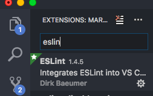

**CLONE THIS PROJECT FROM REPOSITORY**

### Version :
* [react : 16.2.0 ](https://reactjs.org/)

* [react-native : 0.53.0](https://facebook.github.io/react-native/)

        $ git clone https://YOUR_USERNAME@bitbucket.org/techgs/temandiabetes-mobile.git && temandiabetes-mobile
        $ npm install

---

COMPONENT REUSABLE : 

* [Card](https://bitbucket.org/techgs/temandiabetes-mobile/overview#markdown-header-card)

* [Button](https://bitbucket.org/techgs/temandiabetes-mobile/overview#markdown-header-button)

---

## ESLint Setup

* EsLint setup with **VSCode**.

        $ npm install -g eslint
        $ npm install --save-dev eslint-config-rallycoding

    create new file .eslintrc in your project
    
        {
            "extends": "rallycoding"
        }

    Install eslint extension from editor VSCode

* EsLint setup with **ATOM**.

    Install eslint extention from editor ATOM

        $ npm install --save-dev eslint-config-rallycoding 
    
    create new file .eslintrc in yout project.
    
        {
            "extends": "rallycoding"
        }

---

---
## Card

    import { Card, CardSection, Button } from '../../components';

    <View style={styles.container}>
	    <Card>
		    <CardSection>
			    <Text style={styles.text}>ON BOARDING</Text>
		    </CardSection>
            <CardSection>
                <Button>Click Me!!</Button>
            </CardSection>
	    </Card>
    </View>
    
    const styles = {
	    container: {
		    flex: 1,
		    alignItems: 'center',
		    justifyContent: 'center',
		    backgroundColor: color.red
	    },
	    text: {
		    color: '#fff',
		    fontSize: 30,
		    fontWeight: '500',
	    },
    };

Card & CardSection Props

| prop            | default| type         | description                     |
| ----------------| -------|--------------|---------------------------------|
| `containerStyle`| none   | object(style)| outer container style (optional)|

---

---
## Button

    import { Button } from '../../components';

    <View style={styles.container}>
        <Button
            buttonStyle={styles.button}
            textStyle={styles.textButton}
            onPress={() => onSubmit}
        >
            Click Me!!
        </Button>
    </View>

Card & CardSection Props

| prop            | default| type         | description                     |
| ----------------| -------|--------------|---------------------------------|
| `buttonStyle`   | none   | object(style)| outer container style (optional)|
| `textStyle`     | none   | object(style)| additional text button styling (optional)|
| `onPress`       | none   | function     | onPress method (optional)|

---

---
## TextField

    import { TextField } from '../../components';

    <View style={styles.container}>
        <TextField
            value={this.state.text}
            onChangeText={(text) => console.log(text)}
            placeholder="Halooo"
            label="Contact"
            leftIcon={{ uri: 'https://cdn3.iconfinder.com/data/icons/black-easy/512/538642-user_512x512.png' }}
        />
    </View>

Card & CardSection Props
------------------------------------------------------------------------------------------------------------
| prop                   | default| type                     |       description                           |
| -----------------------| -------|--------------------------|---------------------------------------------|
| `containerStyle`       | none   | object(style)            | outer container style (optional)            |
| `inputStyle`           | none   | object(style)            | outer container style (optional)            |
| `value`                | none   | string                   |(optional)                                   |
| `defaultValue`         | none   | string                   |(optional)                                   |
| `onChangeText`         | none   | function)                | method                                      |
| `placeholder`          | none   | string                   | renders placeholder in text field (optional)|
| `leftIcon`             | none   | image uri or require path| image source                                |
| `rightIcon`            | none   | image uri or require path| image source                                |
| `[built in props RN](https://facebook.github.io/react-native/docs/view.html#props)'
------------------------------------------------------------------------------------------------------------

## LIBRARIES
* [react-native-navigation](https://wix.github.io/react-native-navigation/#/)